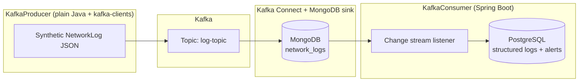

# ThreatSense

Reactive-style **network log processing demo**: a standalone Java producer publishes synthetic JSON logs to **Kafka**, **Kafka Connect** lands them in **MongoDB**, and a **Spring Boot 3** (**Java 17**) consumer watches MongoDB change streams, normalizes rows into **PostgreSQL**, and runs alerting logic.

This repository is suitable as a **portfolio / learning** snapshot of Kafka-centric ingestion patterns (similar ideas often appear in security telemetry pipelines). It is **not** vendor-supported production software.

## Architecture



## Stack

| Piece | Role |
|--------|------|
| **Apache Kafka** + **Zookeeper** (Confluent images) | Message bus for log records |
| **Kafka Connect** | MongoDB sink using `connector_config.json` |
| **MongoDB** | Raw JSON log store (change stream source) |
| **PostgreSQL** | Relational store for structured logs and alerts (`db/schema.sql`) |
| **KafkaProducer** | Maven project: `kafka-clients`, Jackson, Java time support |
| **KafkaConsumer** | Spring Boot: **WebFlux**, **Spring Kafka**, **R2DBC** (PostgreSQL), **reactive MongoDB** |

## Prerequisites

- **Docker** + Docker Compose  
- **JDK 17** and **Maven** (for Java modules)  
- **Windows**, **macOS**, or **Linux** (paths in this README use generic shell patterns; adjust for PowerShell if needed)

## Run locally (overview)

Exact initialization order depends on how quickly containers become healthy on your machine; the sequence below is the usual intent.

### 1. Start infrastructure

From the repo root:

```bash
docker compose up -d
```

This brings up Zookeeper, Kafka, MongoDB, PostgreSQL, and the Kafka Connect worker (which installs the MongoDB connector on startup).

### 2. PostgreSQL schema

Create tables expected by the consumer (see `db/schema.sql`). From the repo root, with Compose services already running:

```bash
docker compose exec -T postgresdb psql -U loguser -d logs_db < db/schema.sql
```

### 3. Register the MongoDB sink connector

After Connect listens on port **8083**, POST the bundled definition (PowerShell example):

```powershell
Invoke-RestMethod -Method Post -Uri "http://localhost:8083/connectors" `
  -ContentType "application/json" `
  -InFile "connector_config.json"
```

Review `connector_config.json` if your MongoDB URI or topic names change.

### 4. Run the producer

```bash
cd KafkaProducer
mvn -q compile dependency:copy-dependencies -DoutputDirectory=target/lib
java -cp "target/classes;target/lib/*" org.example.producer.Producer
```

On macOS/Linux use `:` instead of `;` in the classpath.

### 5. Run the Spring Boot consumer

```bash
cd KafkaConsumer
./mvnw spring-boot:run
```

On Windows use `.\mvnw.cmd spring-boot:run`.

Consumer datasource settings live in `KafkaConsumer/src/main/resources/application.yml` (MongoDB URI and PostgreSQL R2DBC URL currently target **localhost** ports exposed by Compose).

## Configuration notes

- **Synthetic data only** — `Producer.java` generates randomized IPs, ports, and messages for pipeline testing (including occasional “interesting” combinations for alerting experiments).
- **Secrets in Compose/YAML** — credentials are suitable for **local demos**, not production.
- **`mongo-init.js`** expects Mongo root bootstrap variables when creating the application user; if your Mongo container starts without matching root credentials, reconcile `docker-compose.yml` with `mongo-init.js` before relying on authenticated connections.

## Repository layout

| Path | Purpose |
|------|---------|
| `docker-compose.yml` | Kafka, Zookeeper, MongoDB, Postgres, Connect |
| `connector_config.json` | Kafka Connect MongoDB sink configuration |
| `mongo-init.js` | MongoDB user/database bootstrap |
| `db/schema.sql` | PostgreSQL DDL for structured logs and alerts |
| `KafkaProducer/` | Log producer (Maven) |
| `KafkaConsumer/` | Spring Boot consumer (Maven + `mvnw`) |

## License

Apache License 2.0 — see [`LICENSE`](LICENSE).
